  

 

<h2>
  <code>FullStack Web Developer em formação</code>
</h2>

  Construindo interfaces, sistemas e experiências digitais com foco em Web, tecnologia e criatividade.

 

## 🧭 Sobre mim

Sou estudante de **Engenharia de Software** no IFPE, desenvolvendo uma base sólida em programação, estruturação de sistemas e criação de interfaces web modernas.

Atualmente estou focado em evoluir como desenvolvedor **FullStack**, estudando tecnologias de frontend, backend, banco de dados e ferramentas que fazem parte do ciclo completo de desenvolvimento de software.

Também venho explorando Inteligências Artificiais, como a criação de Agents e Skills para otimização e Dev. de Softwares.

 

## Minhas Stacks incríveis :D

 

<table width="100%">
  <tr>
    <td align="center" width="33%">
      <h3>Frontend</h3>
       
      
        
      
        HTML5 • CSS3 • JavaScript • React • Next.js
      
    </td>
    <td align="center" width="33%">
      <h3>Backend</h3>
       
      
        
      
        Node.js • Python • Java • C# • .NET
      
    </td>
    <td align="center" width="33%">
      <h3>Dados & Ferramentas</h3>
       
      
        
      
        PostgreSQL • Git • GitHub • VS Code
      
    </td>
  </tr>
</table>

 

 

## Meu Github :O

 

 

## Fale por aqui!

  

<code>Code. Build. Learn. Repeat.</code>

